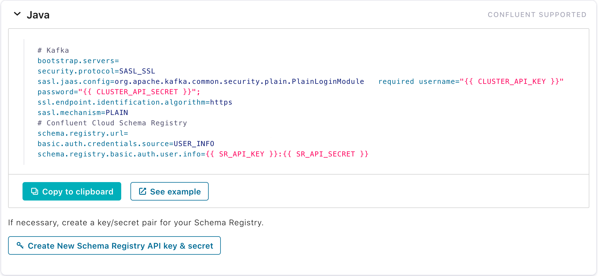

# Confluent Schema Registry Demo
An automated walk-through demo of some key features in Confluent Schema Registry

## Dependencies
- Confluent Kafka environment with Schema Registry

## Include in the environment
- [Jq](https://stedolan.github.io/jq/) - to prettify the JSON output
- [Confluent CLI](https://docs.confluent.io/current/cli/installing.html) - to interact with the Kafka brokers

## Usage
Please refer to the [playbook](playbook.md)
### Local Environment (Confluent Platform)
`schema-demo-local.sh [topic name]`
### Confluent Cloud Environment
`schema-demo-cloud.sh [topic name] [path to cconfig]`

Please refer to [cconfig](cconfig) and enter your creds for your CC environment.
You can find the access information in your CC cluster under the "Tools & client configuration" section

## Updates
